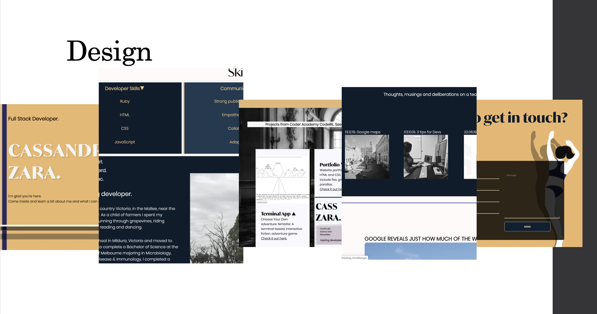

General project documentation is to be compiled as a single markdown file named README.md. This file should contain,

A link (URL) to your published portfolio website
A link to your GitHub repository (repo)
Ensure the repo is accessible by your Educators
Description of your portfolio website, including,
Purpose
Functionality / features
Sitemap
Screenshots
Target audience
Tech stack (e.g. html, css, deployment platform, etc)

## Cassandra Zara 
T1A3 - Portfolio 
url: https://cassandra-zara.netlify.com/
GitHub repository: https://github.com/czara804/website_portfolio
Wireframes: https://www.figma.com/file/gtbDvN1qBY0XfNWnVDpDH8/Portfolio-wireframes?node-id=0%3A1
Moodboard: https://www.figma.com/file/f4F8NXraeTlY5MiGyNAxGx/Portfolio-moodboard?node-id=0%3A1

## Purpose

This website serves as a digital resume for prospective employers seeking developers. The website construction demonstrates proficiency with client software HTML and CSS, vital as a front-end developer. The website also showcases projects in Ruby to demonstrate skill and proficiency with back-end languages. The website is designed to look professional yet personal to help prospective employers gauge personality and skills with links demonstrating an engaged approach and online presence as a developer. 

## Tech Stack 
- HTML
- CSS
- Git version control & GitHub
- Neflify for deployment
- Subresource Integrity (SRI)

## Sitemap

Each page on the website is linked via navigation bar at the top of each page. The initial page is the Portfolio Home (Introduction) or index. From this page the user can navigate to and between 'About', 'Portfolio', 'Blog' and 'Contact'. 

A PDF of the Curriculm Vitae can be downloaded from the 'About' page. 
The 'Portfolio' page contains links to projects posted on GitHub. 
The 'Contact' page sends an e-mail to the owner via a php form. 
The 'Blog' contains a gallry, and individual posts each with a link to the original author. 

## Wireframes

Homepage 

About

Portfolio

Blog

Contact 

## Functionality

The overall aesthetic and design of the website is to allow the user to explore as well as being able to identify the components clearly.

### Text Components

**Navigation Bar**
At the top of each page for ease of access. The visited colours and underline have been removed as they disrupted the back and forth flow of the user. The links the in the navigation bar highlight when there is a hover and the cursor has been made a pointer. The navigation bar switches to a column layout for mobile view for easier access. 

**Footer**
The footer is at the bottom of each page and contains icons as anchors for professional links such as Linkedin and GitHub, and social links (Instagram) that give an impression of personality. The icons are shaped as hexagons to fit with the Art deco theme and coloured to quickly identify between them. 

**Sticky 'About'**
This component contains the text involving education history and also contains a button for downloading resume/CV. The box position is sticky and remains fixed on the page while the background images scroll, creating a parallax effect. The intent behind this component is to create a 'journey' effect as the text content corresponds to the personal images - the mallee where I grew up, Gembrook forest and recent travels to Lisbon, Portugal. 

 **Homepage animation**

 The text components on the homepage (index) align with the background image and have a keyframes animation that moves down from the top of the page upon opening. This text element guides the reader to scroll down and engage in the website blurb. 

 **Blog post**

 This component is replicated for each blog post to allow the styling to remain consistent. Each post contains a title, date with background image and hidden text. The collapsible text is designed via a hidden checkbox that when clicked ('Read more'), expands with a smooth transition. This component stayed true from the initial design stage to minimize the overall height of the page upon opening and for a neater, more minimalist style. 

### Graphic Components 

**Portfolio cards**

This component is a combination of image and text that is designed to group information relating to one portfolio item. The card is designed to be reusable in terms of HTML and CSS block, so that the portfolio can be expanded upon. The items are aligned within a grid with 4 columns in laptop viewport width and realign to 1 column in mobile view. 
The card component contains an image of fixed size for uniform design, a header, arrow, short blurb and external link for extra information or source code. 

**Contact form**

This form allows the user to contact the author by entering their details, a subject and message. The form utilizes netlify (the deployment platform), to send the message and show a confirmation message. The form is designed with flexbox to be responsive in mobile view and the button has hover elements with border outset and inset to demonstrate functionality. The form is back transparent to allow the background image to be viewed and link back to the homepage aesthetic. 

**CV button**

The resume/CV can be downloaded from the 'About' text section on the 'About' page. It is styled with CSS to look like a button with an underline and pointer upon hover to demonstrate functionality. 

**Blog gallery**

The blog page contains a list of blog posts that are linked straight to a post. The gallery images have been filtered with saturate to minimize colour distraction and increase brightness with hover to increase interactivity. Each list item contains an image, date published and brief title. The list is responsive to mobile view and realigns to a column. 

## Responsiveness 

Flex, grid and media querys were used in an effort to make the website reponsive at mobile, tablet and laptop viewport widths. 

 

## Accessibility

- Accessibility for people with colour-blind vision was checked using 'Colorblind - Dalton for Google Chrome'
- aXe 
- HTML validation via 'https://validator.w3.org/'

## Style Aesthetic & Design Variations

The website's aesthetic follows an Art Deco color theme of dark and mid blues with yellow/gold, black and white elements. 
The header banner with name logo was styled in yellow and black are easy to read from far away as a combination and the text colour was modified to a dark blue to fit the aesthetic. 

**Main Design**

**Pink Aesthetic**

## Mood boards

## Design Process

- Mood Board 
- Wireframes
- Started with Navigation and Footer as bookends for page
Layout for portfolio using grid and flex component
Layout for blog with collapsible text and gallery 
Contact via form 
About using parallax for personal images to have ‘journey feel’ 
Homepage with central image to tie together aesthetic and then styled with colour swatches 
